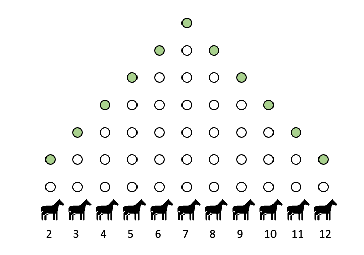
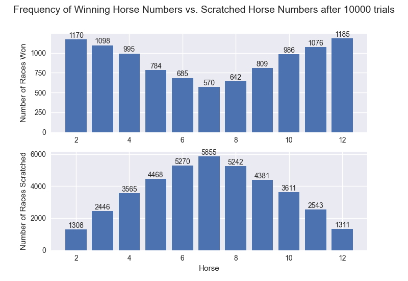
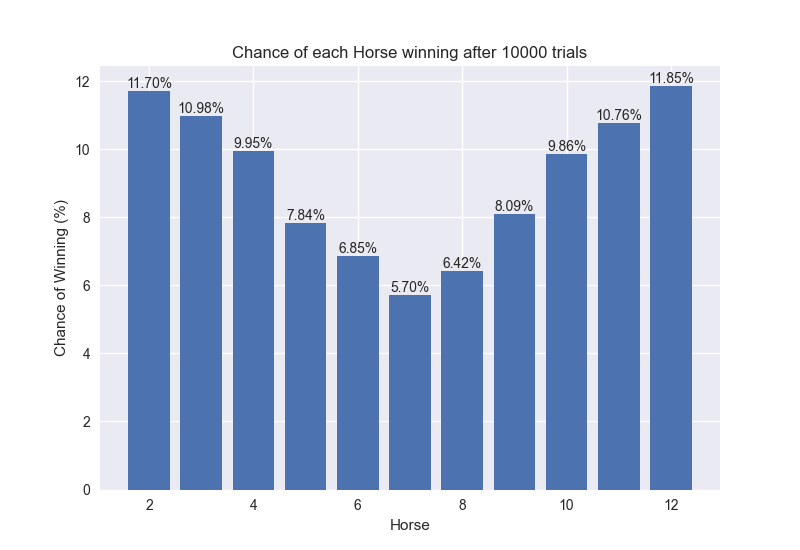

# Overview
This repository provides an analysis of the statistics and probability related to a board game called Horsies. The goal of this analysis is to determine which of the 11 horses has the highest chance of winning.

# Setup
Each player is dealt 4 cards (2-Q) that correspond to 11 horses (2-12). The goal is to have the horse that corresponds to one of your cards cross the finish line first. The horse that moves is determined by the number that comes up when a pair of dice are rolled. The distance each horse must move in order to secure a victory is proportional to the likelihood of those numbers appearing on a pair of dice, as certain numbers have a higher probability of occurrence.

Here are the distances each horse must travel in order to win:
- 2 horse - 2 slots
- 3 horse - 3 slots
- 4 horse - 4 slots
- 5 horse - 5 slots
- 6 horse - 6 slots
- 7 horse - 7 slots
- 8 horse - 6 slots
- 9 horse - 5 slots
- 10 horse - 4 slots
- 11 horse - 3 slots
- 12 horse - 2 slots

See the figure below for a graphical depiction of the board. When a horse makes it to the green dot at the end of its corresponding track, that horse wins and the game is over.

# Gameplay
After each player is given 4 cards, dice are rolled until 4 distinct rolls have occurred. Those 4 numbers indicate "scratched" horses, which means they can not move for the remainder of the race. Keep track of the order of which the horses are scratched. 

After the scratched horses are identified and removed from the race, the remaining horses can move. A player will roll the dice until they roll a value of an active horse. When they do, that horse move up 1 slot and the next player rolls. If a player rolls the value of a scratched horse, they need to pay into the pot and continue rolling until they roll the value of an active horse. Rolling the value of the first horse to get scratched requires a $1 payout from the dice roller. The second horse requires a $2 payout, etc...If a player is holding 2 cards of the same value of a scratched horse, they need to pay double. The game ends when one horse reaches the end. The entire pot is distributed to the players who are holding the card of the winning horse. If Player 1 has 2 cards of the winning horse's value and Player 2 has 1 card, Player 1 gets 2/3 of the pot and Player 2 gets 1/3.

# Results
This figure shows the frequency of which horses scratched versus those that won. As expected, the scratched horses follow the probability distribution we would expect to see with rolling dice; namely, the most frequent horses to get scratched were those that were most probable to be rolled on dice.

Similarly, we can see the probability that a players card will end up being a winner by simply calculating $\frac{\text{frequency of winners}}{\text{total trials}}$. 

# Conclusion
It has been shown that the horses with the highest chance of winning are at the ends of the track. The advantages of a shorter distance to travel in addition to the decreased likelihood of being scratched determines that horses 2 and 12 are the optimal choices.
